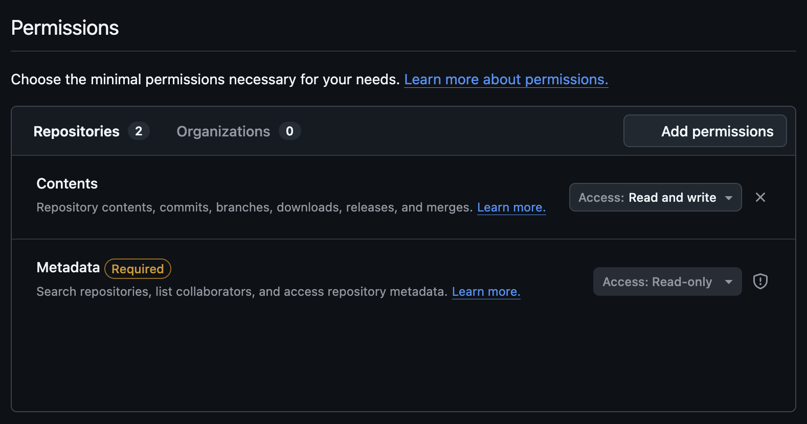
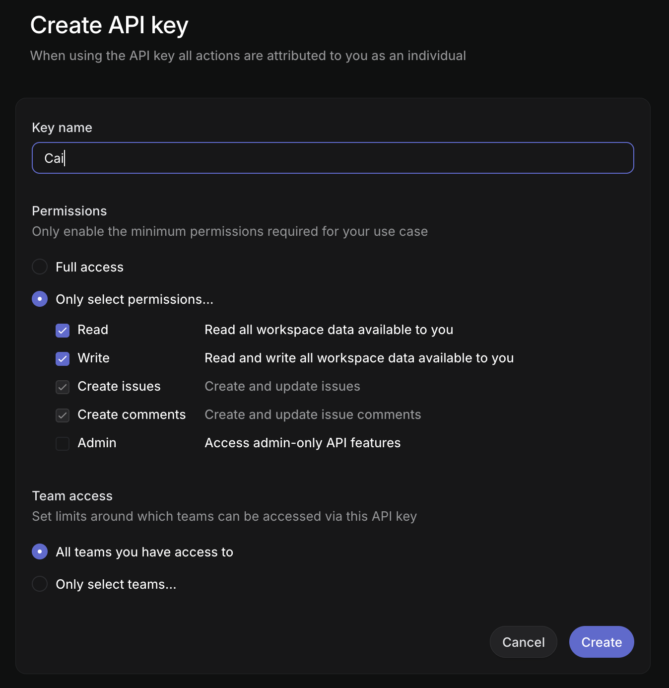

# Connectors

Connectors let Cai create issues and tickets in external services, directly from whatever you select. Select an error, press **Option+C**, and create a GitHub or Linear issue in seconds.

Issue and ticket bodies are sent as **Markdown** — code fences, lists, and headings render properly in the destination.

---

## GitHub

### 1. Create a Personal Access Token

GitHub offers two token types. Pick whichever fits your needs:

- **Fine-grained token** — per-repo scoped, more granular control. Best if you want Cai to only see specific repositories.
- **Classic token** — broader access, quicker setup. Best if you want Cai to work across all your repos and orgs automatically.

#### Option A: Fine-grained token

1. Go to [GitHub Token Settings](https://github.com/settings/personal-access-tokens/)
2. Click **Generate new token** → **Fine-grained token**
3. Set **Token name** (e.g., "Cai")
4. Under **Repository access**, select **Only select repositories** and pick the repos you want Cai to create issues in
5. Under **Permissions → Repository permissions**, set **Issues** to **Read and write**
6. Click **Generate token** and copy it

#### Option B: Classic token

1. Go to [GitHub Token Settings (Classic)](https://github.com/settings/tokens)
2. Click **Generate new token** → **Generate new token (classic)**
3. Set **Note** (e.g., "Cai") and choose an expiration
4. Enable these scopes:
   - **`repo`** — full repository access. Needed for creating issues, commenting, adding labels, and searching private repos.
   - **`read:org`** — under `admin:org → write:org → read:org`. Needed so Cai can detect the orgs you belong to.
5. Click **Generate token** and copy it

> Classic tokens automatically see every org and repo you have access to — no per-repo selection needed.

### 2. Add to Cai

1. Open Cai → **Settings** → **Connections** → **Tools**
2. Expand **GitHub** and paste your token (`ghp_...` for classic, `github_pat_...` for fine-grained)
3. Click **Save**, then **Test Connection**

You're all set. "Create GitHub Issue" will now appear in your action list when you press Option+C.

> **Privacy:** Your token is stored in macOS Keychain, never in config files or sent anywhere except GitHub's API.

---

## Linear

### 1. Create an API Key

1. Go to [Linear API Key Settings](https://linear.app/settings/account/security/api-keys/new)
2. Set **Label** (e.g., "Cai")
3. Set **Permission** to **Read & Write**
4. Set **Team access** to **All teams you have access to**
5. Click **Create** and copy the key

### 2. Add to Cai

1. Open Cai → **Settings** → **Connections** → **Tools**
2. Expand **Linear** and paste your API key (`lin_api_...`)
3. Click **Save**, then **Test Connection**

You're all set. "Create Linear Issue" will now appear in your action list when you press Option+C.

> **Privacy:** Your API key is stored in macOS Keychain, never in config files or sent anywhere except Linear's API.
